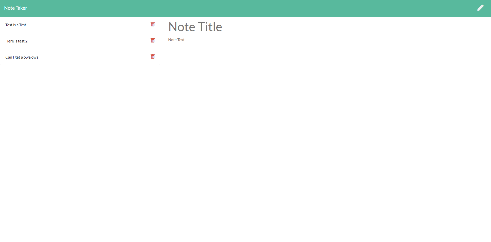

# Note-Taker-App [](http://unlicense.org/)

This is an app where the user can take notes and save them in the database. Once they no longer need the notes, they can delete them.

# Tables of Contents

- [Installation](#installation)
- [Usage](#usage)
- [Contributing](#contributing)
- [Tests](#tests)
- [Questions](#questions)
- [Application](#application)
- [Credits](#credits)

# Installation

install npm, inquirer, and uuid

# Usage

```md
npm start
```

to run the server

# Contributing

There are no Contributings

# Test

There are no test instructions

# License

There are no licenses for this project

# Questions

If you have any questions, feel free to email me at Donnahuegjr@gmail.com.

# Application



[Link to Application](https://ancient-thicket-76046.herokuapp.com/)

# Credits

Github: www.github.com/Latinobull
Copyright Donnahue George. All Rights Reserved.
